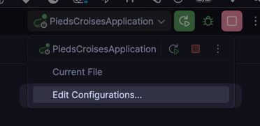
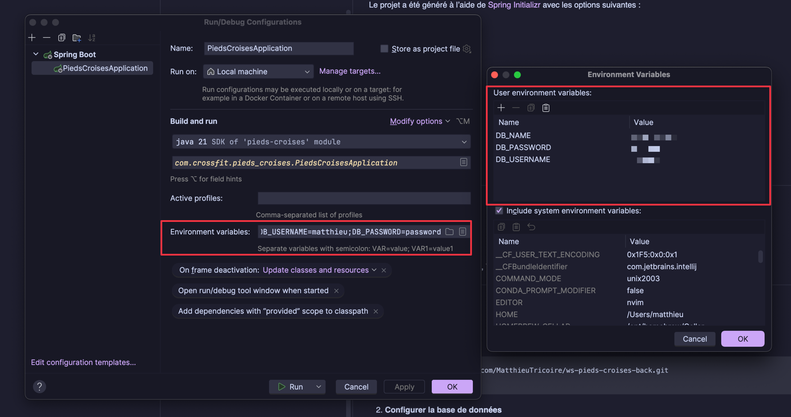
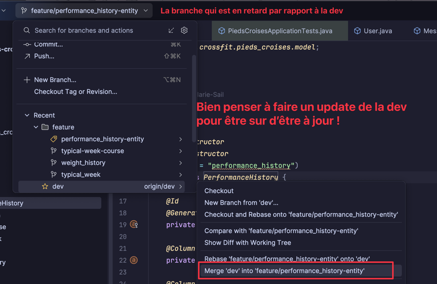

# 🏋️‍♀️ pieds-croises

Ce projet est une application Spring Boot initialisée avec [Spring Initializr](https://start.spring.io/) et utilisant
Maven comme outil de build.  
Il sert de base pour développer une API REST.

---

## 🚀 Stack technique

- Java 21
- Spring Boot 3.3.1
- Maven
- Spring Web
- Spring Data JPA
- Lombok

---

## ⚙️ Initialisation du projet

Le projet a été généré à l’aide de [Spring Initializr](https://start.spring.io/) avec les options suivantes :

- **Project** : Maven
- **Language** : Java
- **Spring Boot** : 3.x.x
- **Packaging** : Jar
- **Java** : 17+
- **Dependencies** :
    - Spring Web
    - Spring Data JPA
    - Lombok
    - Spring Boot DevTools
    - MySQL Driver
    - jsonwebtoken

---

## 🛠️ Prérequis

- Java 17 ou +
- Maven 3.8+
- Un IDE (ex: IntelliJ, Eclipse, VS Code)

---

## 📦 Installation

1. **Cloner le dépôt**

```bash
git clone https://github.com/MatthieuTricoire/ws-pieds-croises-back.git
cd ws-pieds-croises-back
```

2. **Configurer la base de données**

    - Créer une base de données MySQL nommée `pieds_croises`
    - Mettre à jour le fichier `src/main/resources/application.properties` avec vos informations de connexion à la base
      de données. Il est possible de définir les variables d'environnement directement dans la configuration du backend.

   
   

## Charger le fichier application-dev.properties lors du lancement local

```
spring.config.import=optional:classpath:.env.dev
spring.datasource.url=jdbc:mysql://localhost:3306/${DB_NAME}?createDatabaseIfNotExist=true
```

## 📦️ Workflow Git

Les nouvelles branches de features ou de corrections doivent toujours être créées depuis la branche `dev`

### Création d'une pull request

Pour passer les tests mis en place sur github, une PR doit toujours être préfixée par 'feature/ ' ou 'fix/ '

#### Rebase pour se se mettre à jour par rapport à la dev

